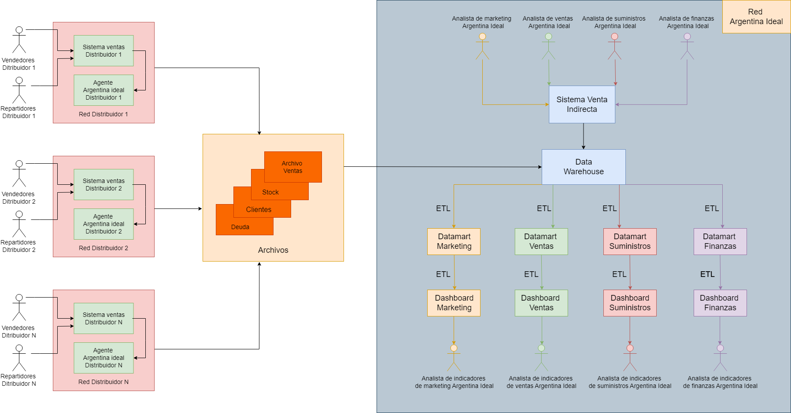

# Generación de datos

## El código de este directorio

Los notebooks que se encuentran en este directorio son los encargados de generar la información que los distribuidores envían a **"Argentina Ideal"** diariamente.

Podrán notar que hay más de un notebook y que cada uno tiene un **"VN"** al final de su nombre, donde **N** indica el número de versión del notebook, esto es debido a que este proceso ha sido iterativo y se ha ido mejorando el código según fuimos relevando requerimientos para la correcta generación de los datos. Aquí dejamos un vistazo de la estructura de este directorio:

```sh
C:.
├───generacion_datos
│       Generador_de_archivos_V0.ipynb #Nuestra primera iteración, se encargaba de generar los archivos de forma local
│       Generador_de_archivos_V1.ipynb #El código que usamos actualmente para subir la información a Google Cloud Storage
│       TP_Final_Especificacion_1.xlsx #Archivo excel con especificaciones de como se deben generar los campos de los archivos
│       ..
```

## Descipción de los archivos

El sistema de los distribuidores cuenta con un componente de software que es capaz de generar, a partir de la información de su sistema de ventas, 
los archivos en formato csv. A continuación dejamos una descripción de cada archivo:

* **Venta:** Contiene la venta que los distribuidores ha realizado a los negocios minoristas en un día. En este archivo se debe considerar para un mismo cliente, misma fecha, mismo SKU (código de producto), la sumatoria de lo facturado considerando en el archivo una sola línea para cada combinación de Cliente/fecha/SKU.

* **Deuda:** Contiene la deuda que los negocios minoristas tienen con los distribuidores. Este archivo debe contener los montos de deuda vencida y total por cliente por día.

* **Stock:** Debe contener el saldo del stock al cierre de cada día, de todos los productos que tenga el distribuidor asignado a la sucursal. Estos, deben sumarizar tanto los stocks en almacén o depósito. Este archivo deberá contener información del día de cierre comercial.

* **Maestro/Cliente:** Deben incluirse en este archivo a todos los clientes del distribuidor. Los clientes que sean dados de baja deberán reflejarse con el campo 
Estado = I.

## Flujo de la información

Para un mejor entendimiento de como se maneja la información en **"Argentina Ideal"** les dejamos una imagen:


